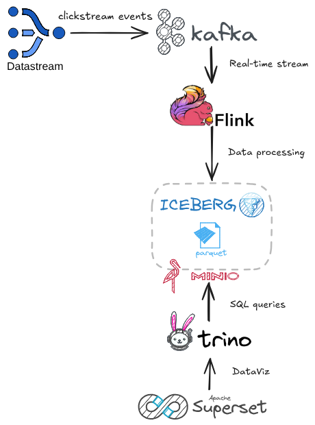

**E2E Real-Time Data Pipeline with Kafka, Flink, Iceberg, Trino, MinIO, and Superset**
======================================================================================


A local, containerized streaming pipeline you can run end to end on one machine.
A Python producer invents fake clickstream events; Flink filters them to
purchases and writes Iceberg tables to MinIO; Trino queries them with SQL;
Superset charts the results.



1. **Clickstream Data Generator** simulates real-time user events and pushes
   them to a Kafka topic.
2. **Apache Flink** processes the Kafka stream — keeping only purchases — and
   writes clean data to **Iceberg** tables stored on **MinIO**.
3. **Trino** connects to Iceberg for querying the processed data.
4. **Apache Superset** visualizes the data by connecting to Trino.

See **[docs/ARCHITECTURE.md](docs/ARCHITECTURE.md)** for the full picture.

---

## Requirements

- Docker and Docker Compose (v2, the `docker compose` subcommand)
- ~8–16 GB RAM. Core services run by default; Trino and Superset are opt-in
  because they are the heavy ones.

---

## How to run

```bash
make up          # start the core pipeline (Kafka, Flink, MinIO, Iceberg, producer)
make trino       # add the SQL query engine
make superset    # add dashboards (heaviest; builds an image)
make test        # verify it works
make query       # open a Trino SQL shell
make clean       # stop everything and wipe data (full reset)
```

`make up` takes a few minutes on a cold start — the Flink SQL client image
downloads its connector JARs on first build.

Other targets: `make down` (stop, keep data), `make logs`, `make ps`,
`make test-full`. Run `make` targets from the repo root.

<details>
<summary>Raw <code>docker compose</code> equivalents</summary>

```bash
# make up
docker compose up -d zookeeper broker minio mc rest jobmanager taskmanager sql-client producer

# make trino
docker compose up -d trino

# make superset
docker compose up -d --build superset

# make query
docker compose exec trino trino

# make down / make clean
docker compose down
docker compose down -v

# make logs / make ps
docker compose logs -f
docker compose ps -a          # -a matters: plain ps hides dead containers

# optional Kafka UI (memory hungry, not started by default)
docker compose --profile ui up -d control-center
```

</details>

---

## Verify it works

```bash
./smoke-test.sh          # fast (~1 min)
./smoke-test.sh --full   # end to end (~3 min)
```

**Fast** checks that every core container is running, that the Flink job is
`RUNNING` rather than crash-looping, and that data files have actually landed in
the MinIO warehouse bucket.

**Full** additionally queries Trino twice, 45 seconds apart, and asserts the row
count grew — proving events are flowing all the way through, not just that
services are up.

Both print `PIPELINE OK` or `PIPELINE BROKEN` and exit non-zero on failure.
`make test` and `make test-full` are the same two commands.

---

## Access the services

| Service | URL | Credentials |
| --- | --- | --- |
| Flink Dashboard | http://localhost:18081 | none |
| MinIO Console | http://localhost:9001 | `admin` / `password` |
| Trino UI | http://localhost:8080/ui | none |
| Superset | http://localhost:8088 | `admin` / `admin` |
| Kafka Control Center *(opt-in)* | http://localhost:9021 | none |

> All credentials default to demo values. To override any of them,
> `cp env.example .env` and edit.

### Query the data

```bash
make query
```

```sql
SELECT * FROM iceberg.db.clickstream_sink
WHERE purchase_amount > 100
LIMIT 10;
```

### Connect Superset to Trino

Superset starts empty. Add the connection under **Settings → Database
Connections → + Database → Trino**, using this SQLAlchemy URI:

```
trino://trino@trino:8080/iceberg/db
```

---

## What's in the repo

```
├── docker-compose.yaml   # all services and how they wire together
├── Makefile              # the supported commands
├── smoke-test.sh         # pipeline verification
├── env.example           # demo credentials -> copy to .env
├── docs/                 # architecture and troubleshooting
├── producer/             # Python clickstream generator (Faker)
├── flink/                # SQL client image + the streaming job
├── superset/             # Superset image and config
└── trino/                # Trino Iceberg catalog config
```

The only real logic is [`producer/producer.py`](producer/producer.py) and
[`flink/sql-jobs/clickstream-filtering.sql`](flink/sql-jobs/clickstream-filtering.sql).
Everything else is wiring and configuration — the services themselves are
off-the-shelf Docker images.

### The event

The producer emits one JSON event per second to the Kafka topic `clickstream`,
keyed by `session_id`:

```python
{
  "event_id": fake.uuid4(),
  "user_id": fake.uuid4(),
  "event_type": fake.random_element(elements=("page_view", "add_to_cart", "purchase", "logout")),
  "url": fake.uri_path(),
  "session_id": fake.uuid4(),
  "device": fake.random_element(elements=("mobile", "desktop", "tablet")),
  "geo_location": {"lat": float(fake.latitude()), "lon": float(fake.longitude())},
  "purchase_amount": float(random.uniform(0.0, 500.0)) if fake.boolean(chance_of_getting_true=30) else None
}
```

There is deliberately no timestamp field — Flink uses Kafka's broker arrival
time instead. The Flink job keeps only `purchase` events, flattens
`geo_location` into `latitude` / `longitude`, and appends the result to the
Iceberg table `iceberg.db.clickstream_sink`.

---

## Common issues

Symptom → fix → details. Full write-ups in
[docs/TROUBLESHOOTING.md](docs/TROUBLESHOOTING.md).

- **Superset won't load at :8088 right after start** → it's still booting (db
  migrations run on every start); wait and watch `docker logs superset -f` →
  [#6](docs/TROUBLESHOOTING.md#6-superset-page-wont-load-right-after-start)
- **Flink job stuck RESTARTING, `No resolvable bootstrap urls`** → the broker
  lost its startup race with ZooKeeper; `docker compose up -d broker` and the
  job self-heals →
  [#3](docs/TROUBLESHOOTING.md#3-flink-job-stuck-restarting-no-resolvable-bootstrap-urls-given-in-bootstrapservers)
- **`NoSuchBucketException: The specified bucket does not exist`** → the MinIO
  `warehouse` bucket was never created; recreate it and restart `sql-client` →
  [#2](docs/TROUBLESHOOTING.md#2-flink-error-nosuchbucketexception-the-specified-bucket-does-not-exist)
- **Job says RUNNING but MinIO has no data files** → Iceberg commits only on
  checkpoints; give it a full 10s interval before judging →
  [#4](docs/TROUBLESHOOTING.md#4-job-runs-but-no-data-files-appear-in-minio)

---

## Documentation

- **[docs/ARCHITECTURE.md](docs/ARCHITECTURE.md)** — how it works: what each
  component does, the life of a single event, and why storage is split into
  MinIO + Iceberg + Trino instead of one database.
- **[docs/TROUBLESHOOTING.md](docs/TROUBLESHOOTING.md)** — when it breaks: real
  failures with symptom, diagnosis, fix, and root cause.

---

## Known tradeoffs

Deliberate choices, not bugs:

- Every `sql-client` restart runs `DROP TABLE` first, destroying the sink table
  and its snapshot history. Reruns start clean.
- `json.ignore-parse-errors=true` silently drops malformed messages.
- A 10s checkpoint interval produces many small Parquet files. Compaction and
  partitioning are future work.

---

## Screenshots

<details>
<summary>Kafka topic, Flink job, MinIO warehouse, Trino, Superset</summary>


</details>

---

## Roadmap

- CI running the smoke test on every push
- Migrate Kafka to KRaft mode (drop ZooKeeper)
- Replace the CTAS + DROP pattern with `CREATE TABLE IF NOT EXISTS` + `INSERT`
  for persistent tables

Contributions welcome — issues and pull requests are fine.
