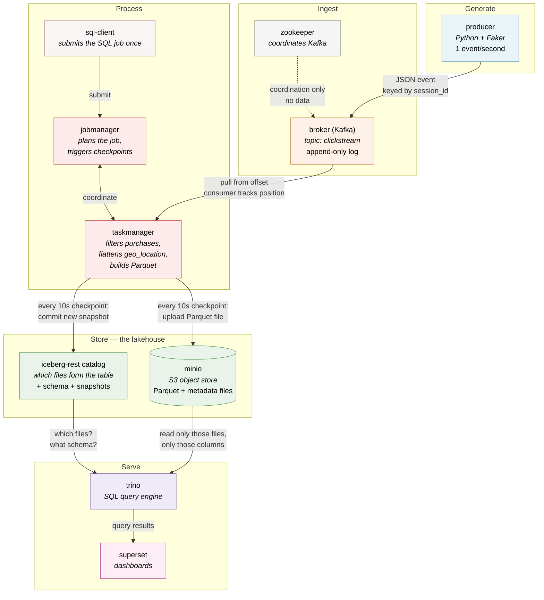

# Architecture

## What this pipeline does

A small Python program invents fake clickstream events — someone viewed a page,
added an item to a cart, made a purchase — and sends one every second to Kafka, a
system that holds a stream of messages. Flink, a stream processor, reads that
stream continuously, throws away everything that is not a purchase, reshapes the
rows it keeps, and writes them into a table stored as files in MinIO, an
S3-compatible object store. That table is registered in the Iceberg catalog, which
records which files currently make up the table. Trino, a SQL query engine, reads
the same catalog and lets you run ordinary SQL against those files. Superset, a
dashboard tool, sends its SQL to Trino and draws charts. Events flow in one
direction, end to end, and new purchases become queryable within about ten seconds
of being produced.

---

## The key thing to understand first

**This repository contains almost no software.**

Kafka, ZooKeeper, Flink, MinIO, Trino, and Superset are large, mature systems
written by other people over many years. None of their source code is here. They
arrive as **Docker images** — pre-built, ready-to-run packages downloaded from the
internet the first time you start the project.

Think of it as a kitchen. **The appliances were bought, the recipe was written.**

You did not build the oven, the blender, or the fridge. You bought them
ready-made. What is yours is the recipe: which appliance to use, in what order,
with what ingredients, and how they connect.

Everything in this repo falls into one of three buckets:

| Bucket | What it is | Where it lives |
| --- | --- | --- |
| **The wiring** | Which appliances to plug in, which can see which, what starts before what | `docker-compose.yaml` |
| **The logic** | The only real business logic in the project | `producer/producer.py` (invents events) and `flink/sql-jobs/clickstream-filtering.sql` (filters and reshapes them) |
| **The configuration** | Addresses, ports, credentials, file formats — telling each appliance where its neighbors are | `trino/iceberg.properties`, `flink/sql-client/flink-conf.yaml`, `superset/`, and the environment variables in the compose file |

That is the whole project. A Python file, a SQL file, and a pile of addresses.

This matters when something breaks. A failure is almost never a bug inside Kafka
or Trino — those are battle-tested. It is nearly always a wiring or configuration
problem: a wrong hostname, a service that started before its dependency was ready,
a credential that does not match.

---

## The components

Each service is a separate container with its own filesystem and process. They
talk to each other over a private Docker network by hostname.

| Service | What it is | Its one job here | Who it talks to |
| --- | --- | --- | --- |
| `producer` | A Python script using the Faker library | Invent one fake clickstream event per second and send it to Kafka | Kafka only |
| `broker` | Apache Kafka — a distributed append-only log for messages | Hold the `clickstream` stream of events and hand them to whoever asks | The producer (writes), Flink (reads), ZooKeeper (coordination) |
| `zookeeper` | Apache ZooKeeper — a coordination service | Keep Kafka's internal bookkeeping (which broker is alive, which topics exist). Pure plumbing for Kafka; no data passes through it | Kafka only |
| `jobmanager` | Apache Flink's coordinator | Accept a job, plan it, split it into tasks, and coordinate checkpoints (see below) | TaskManager, SQL client |
| `taskmanager` | Apache Flink's worker | Actually run the stream processing: read from Kafka, filter, write files to MinIO | JobManager, Kafka, MinIO, the Iceberg catalog |
| `sql-client` | A short-lived Flink SQL shell | Submit `clickstream-filtering.sql` to the JobManager once at startup, then get out of the way | JobManager |
| `minio` | MinIO — an S3-compatible object store | Store the actual data files (Parquet) and Iceberg's metadata files. It is dumb storage: it knows about buckets and files, nothing about tables | Flink (writes), Trino (reads), the Iceberg catalog |
| `rest` (`iceberg-rest`) | The Apache Iceberg REST catalog | Answer one question: "which files currently make up table X, and what is its schema?" It stores no data | Flink, Trino, MinIO |
| `trino` | Trino — a distributed SQL query engine | Answer SQL questions by asking the catalog which files to read, then reading them from MinIO | The Iceberg catalog, MinIO, Superset |
| `superset` | Apache Superset — a BI / dashboard tool | Turn SQL results into charts and dashboards for a human | Trino only |
| `control-center` | Confluent Control Center (optional UI) | Let a human watch Kafka topics in a browser. Not part of the data flow | Kafka |
| `mc` | The MinIO command-line client | Create the `warehouse` bucket at startup, then idle. A one-time setup helper | MinIO |

### Each component only knows its direct neighbors

This is the most important property of the whole design, and it is easy to miss.

**Trino has never heard of Kafka.** There is no Kafka setting anywhere in Trino's
configuration. Trino does not know events are streaming, does not know Flink
exists, and does not know the data arrived a few seconds ago rather than a few
years ago. All Trino knows is: there is an Iceberg catalog at a certain address,
and there are files in MinIO.

Likewise, Kafka does not know Flink is reading from it — it just serves messages
to whoever connects. The producer does not know Flink, Trino, or Superset exist.
Superset knows only Trino.

Each link is a narrow, well-defined contract:

```
producer → Kafka:     "here is a JSON message"
Flink → Kafka:        "give me messages from offset N"
Flink → MinIO:        "store this file"
Flink → catalog:      "these files are now part of the table"
Trino → catalog:      "which files are in the table?"
Trino → MinIO:        "give me those files"
Superset → Trino:     "run this SQL"
```

Because of this, you could swap Superset for a different BI tool and nothing else
would change. You could point a second query engine at the same catalog and it
would see the same tables.

---

## Following one event through the pipeline

Here is the life of a single purchase event, from invention to chart.

### 1. The producer invents it

Every second, `producer.py` builds a Python dictionary with random values: a
`user_id`, an `event_type` chosen at random from `page_view`, `add_to_cart`,
`purchase`, `logout`, a `url`, a `device`, a nested `geo_location` with `lat` and
`lon`, and sometimes a `purchase_amount`. Say this one comes out as a `purchase`.

The dictionary is converted to JSON text and sent to Kafka with the `session_id`
as its key. (Kafka uses the key to decide which partition a message goes to, so
all events from one session stay in order relative to each other.)

Note what the event does *not* contain: a timestamp field. That matters in step 3.

### 2. Kafka appends it to the topic

A Kafka **topic** is an append-only log — a numbered list of messages that only
ever grows at the end. Our topic is called `clickstream`. The new message is
appended and given the next number, called an **offset**. Nothing is ever
modified or reordered; a message just sits at its offset until Kafka's retention
policy eventually deletes old ones.

Crucially, **Kafka does not push messages to anyone, and does not track who has
read what**. Consumers pull. Each consumer remembers its own position — "I have
read up to offset 4,812" — and asks for what comes next. This is why several
different consumers can read the same topic at their own speeds without
interfering, and why a consumer that crashes can resume exactly where it left off.

### 3. Flink reads it, filters it, and reshapes it

The Flink job, defined entirely in `clickstream-filtering.sql`, is a single
never-ending SQL statement. For our event it does three things.

**Decodes it.** The `CREATE TABLE clickstream_source` statement in that file does
not create or copy any data. It is a *lens*: a description of how to read the raw
bytes sitting in the Kafka topic as rows and columns. Drop that table and the
Kafka topic is untouched.

The lens also attaches a timestamp. Since the JSON has no time field, the job
takes the timestamp Kafka's broker stamped on the message when it arrived
(`METADATA FROM 'timestamp'`). That is **processing time** — when the pipeline saw
the event — not **event time**, when the user supposedly clicked. For this demo
they are nearly identical, but the distinction matters in any real system with
late or replayed data.

**Filters it.** The job keeps only rows where `event_type = 'purchase'` and
`device IS NOT NULL`. Roughly three quarters of all events are discarded here and
never touch storage. Our event is a purchase, so it survives.

**Flattens it.** The nested `geo_location` structure is unpacked into two flat
columns, `latitude` and `longitude`. Flat columns are far easier to query in SQL
and to chart in Superset than nested ones.

The surviving row is then encoded into **Parquet**, a columnar file format that
stores each column's values together rather than each row's. That layout compresses
far better and lets a query that touches three columns read only those three.

The row does not become a file immediately. Flink accumulates rows in its own
memory and disk (its "state"), building up a file as more purchases arrive.

### 4. Every 10 seconds, a checkpoint commits the file

A **checkpoint** is Flink taking a consistent snapshot of everything in flight:
how far it has read in Kafka, and what it has buffered. This job checkpoints every
10 seconds.

The checkpoint is also the moment data becomes visible. On each one, Flink:

1. Closes the Parquet file it was building and uploads it to MinIO.
2. Tells the Iceberg REST catalog: "the table now consists of the old files
   **plus** this new one." The catalog writes a new **snapshot** — a fresh listing
   of the table's files — and moves the table's pointer to it.

Both steps happen together, atomically. Either the snapshot is committed and all
its rows appear at once, or nothing appears at all. There is no state where a
reader sees half a file.

This is why **the table only updates every ~10 seconds, not continuously**. Between
checkpoints, Flink is writing files that no reader can see yet. It is also what
makes the pipeline crash-safe: the job is configured for `EXACTLY_ONCE`, so if the
TaskManager dies mid-flight, Flink rewinds to the last completed checkpoint, replays
the Kafka messages after that offset, and discards the uncommitted work of the dead
attempt. Each purchase lands in the table exactly once — not duplicated by the
replay, not lost in the crash.

### 5. Trino answers a SQL question

Someone runs `SELECT * FROM iceberg.db.clickstream_sink WHERE purchase_amount > 100`.

Trino does not scan the storage bucket looking for data. It asks the same Iceberg
REST catalog that Flink writes to: "what is the current snapshot of this table, and
which files does it contain?" The catalog hands back a file list and the schema.
Trino then fetches exactly those Parquet files from MinIO, reads only the columns
the query mentions, and computes the answer.

Because Trino reads whatever snapshot is current at the moment the query starts, a
query issued mid-checkpoint sees the previous complete snapshot — never a partial
one.

### 6. Superset draws a chart

Superset holds no pipeline data of its own. When a dashboard panel refreshes, it
generates SQL, sends it to Trino over an ordinary database connection, and renders
whatever comes back. Refresh a few seconds later and a newly committed snapshot
gets picked up, so the dashboard follows the stream.

---

## Why split storage into MinIO + Iceberg + Trino instead of one database?

The first time you see this, it looks like needless complexity. A single
PostgreSQL server would store the data, define the tables, and answer the queries.
Why three things?

Because a traditional database is really **three jobs fused into one program**:

1. **Storage** — writing bytes to disk durably.
2. **Table format** — knowing that those bytes form a table with these columns,
   these rows, and this version history.
3. **Query engine** — parsing SQL, planning it, and computing results.

PostgreSQL does all three, and they are inseparable. That fusion is exactly why
it is easy to use — and exactly why only PostgreSQL can read PostgreSQL's files.

A **lakehouse** unbundles those three jobs into three replaceable pieces:

| Job | Here | What it knows |
| --- | --- | --- |
| Storage | **MinIO** | Buckets and files. Nothing about tables |
| Table format | **Apache Iceberg** (plus the REST catalog) | Which files make up which table, the schema, and the history of every version. Stores no data itself |
| Query engine | **Trino** (and Flink, when writing) | How to plan and execute SQL over those files |

What you gain by separating them:

**Multiple engines share one copy of the data.** This is the big one, and this repo
demonstrates it directly: **Flink writes the table and Trino reads it, at the same
time, with no export step between them.** Two entirely different systems — one
built for streaming, one for interactive queries — operate on the same physical
files, and neither had to be told about the other. In a bundled database, getting
data from a stream processor into a query engine means copying it. Add a Spark job
or a Python notebook later and it joins the same table the same way.

**Each layer scales on its own.** Storage is cheap and grows without limit. Query
capacity is expensive and needed only while queries are running. Split apart, you
can add storage without adding compute, or shut down Trino overnight without
touching a byte of data. Fused together, storage and compute grow as one.

**Each layer can be swapped.** MinIO can be replaced by Amazon S3 by changing an
endpoint — the table format and query engine neither know nor care. Trino can be
replaced by another engine that speaks Iceberg. The data outlives any single tool
that reads it, because the format is open and not owned by the engine.

**The table format brings real database guarantees to plain files.** Iceberg is
what makes the pile of Parquet files behave like a table rather than a folder:
atomic commits (a reader never sees a half-written batch), schema evolution
(add a column without rewriting history), and time travel (query the table as it
was at any past snapshot, because every snapshot is retained).

The trade-off is honest: more moving parts, more configuration, more ways to
misconfigure something. For a few gigabytes and one application, PostgreSQL is
the better answer. The unbundling pays off when several engines need the same data
and the volume outgrows what one machine can hold.

---

## Data flow diagram



Read the arrows as the only conversations that exist in the system. Nothing talks
to anything it has no arrow to.

---

## The vocabulary, in one place

- **Topic** — a named, append-only stream of messages in Kafka.
- **Offset** — a message's position number in a topic. Consumers track their own.
- **Consumer** — anything reading from a topic. Kafka pushes nothing; consumers pull.
- **State** — what a stream processor remembers between messages (here: how far it
  has read, and rows not yet written out).
- **Checkpoint** — a consistent snapshot of a Flink job's state, taken every 10
  seconds here. Also the moment new data becomes visible downstream.
- **Exactly-once** — the guarantee that each input event affects the output exactly
  one time, even across crashes and replays.
- **Object store** — storage that holds whole files (objects) in flat buckets,
  addressed by name. MinIO speaks the S3 protocol, the de facto standard.
- **Parquet** — a columnar file format. Stores column-by-column instead of
  row-by-row, so it compresses well and queries read only the columns they need.
- **Table format** — the layer that turns a set of files into a table with a
  schema, versions, and atomic changes. Iceberg, here.
- **Catalog** — the service that answers "which files make up table X right now?"
  Both Flink and Trino ask the same one.
- **Snapshot** — one committed version of an Iceberg table: the exact file list at
  a point in time. Kept, which is what makes time travel possible.
- **Lakehouse** — storage, table format, and query engine as three separate,
  swappable pieces rather than one fused database.

---

*For setup, configuration, and how to run any of this, see the [README](../README.md).*
